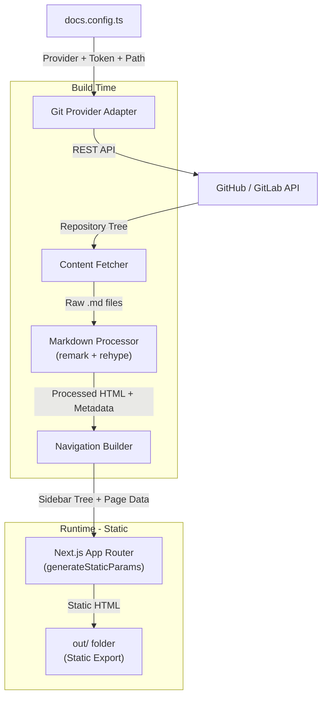
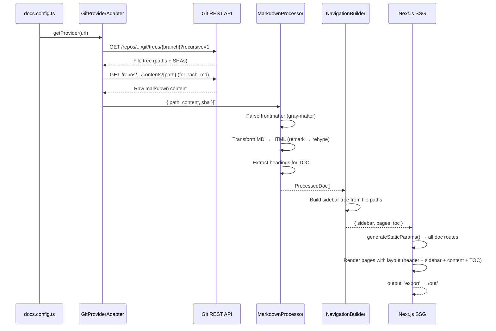

# Markdown Docs Site — Design

**Spec**: `.specs/features/markdown-docs-site/spec.md`
**Context**: `.specs/features/markdown-docs-site/context.md`
**Status**: Draft

---

## Architecture Overview

O sistema segue uma arquitetura de **build-time processing**: durante o `next build`, um pipeline busca markdowns de um repositório Git via REST API, processa-os com o ecossistema unified (remark/rehype) e gera páginas estáticas com Next.js 16 (`output: 'export'`).



### Data Flow



---

## Code Reuse Analysis

### Existing Components to Leverage

| Component       | Location                | How to Use                                    |
| --------------- | ----------------------- | --------------------------------------------- |
| Next.js 16 App  | `app/`                  | Base do projeto — extender com layout de docs |
| Tailwind CSS 4  | `postcss.config.mjs`    | Design system — tokens de tema customizáveis  |
| TypeScript      | `tsconfig.json`         | Tipagem para config, modelos e componentes    |

### Integration Points

| System          | Integration Method                                          |
| --------------- | ----------------------------------------------------------- |
| GitHub REST API | `GET /repos/{owner}/{repo}/git/trees/{sha}?recursive=1`    |
| GitLab REST API | `GET /projects/{id}/repository/tree?recursive=true&ref=...` |
| Next.js SSG     | `output: 'export'` + `generateStaticParams()`              |

---

## Components

### 1. Configuration Layer (`lib/config/`)

#### `DocsConfig` — Configuration Loader

- **Purpose**: Carrega e valida a configuração do `docs.config.ts`
- **Location**: `lib/config/docs-config.ts`
- **Interfaces**:
  ```typescript
  interface DocsConfig {
    // Source
    source: {
      type: 'github' | 'gitlab' | 'local';
      url?: string;              // ex: "https://github.com/org/repo"
      branch?: string;           // default: "main"
      docsPath?: string;         // default: "docs"
      token?: string;            // env var reference: process.env.DOCS_GIT_TOKEN
    };
    // Theme
    theme?: {
      name: string;              // Project name displayed in header
      logo?: string;             // Path to logo image or URL
      favicon?: string;          // Path to favicon
      colors?: {
        primary: string;         // ex: "#6366f1"
        accent?: string;         // ex: "#8b5cf6"
        background?: string;     // ex: "#ffffff"
        foreground?: string;     // ex: "#0f172a"
        sidebar?: string;        // ex: "#f8fafc"
      };
      font?: {
        heading?: string;        // Google Font name, ex: "Inter"
        body?: string;           // Google Font name, ex: "Inter"
        code?: string;           // Monospace font, ex: "JetBrains Mono"
      };
    };
    // Navigation
    nav?: {
      links?: Array<{           // Header external links
        label: string;
        url: string;
        icon?: string;
      }>;
    };
  }
  ```
- **Dependencies**: Nenhuma externa
- **Reuses**: TypeScript config pattern do próprio `next.config.ts`

---

### 2. Git Provider Layer (`lib/git/`)

#### `GitProviderAdapter` — Provider Abstraction

- **Purpose**: Abstrai a comunicação com diferentes providers Git via Strategy Pattern
- **Location**: `lib/git/provider-adapter.ts`
- **Interfaces**:
  ```typescript
  interface GitProvider {
    fetchTree(config: SourceConfig): Promise<FileTreeEntry[]>;
    fetchFileContent(config: SourceConfig, path: string): Promise<string>;
  }

  interface FileTreeEntry {
    path: string;            // ex: "getting-started/installation.md"
    type: 'blob' | 'tree';  // file or directory
    sha: string;
  }

  function createProvider(config: SourceConfig): GitProvider;
  ```
- **Dependencies**: `fetch` (built-in Node.js 18+)
- **Reuses**: Nada — novo componente

#### `GitHubProvider`

- **Purpose**: Implementação do GitProvider para GitHub REST API
- **Location**: `lib/git/providers/github.ts`
- **API Endpoints**:
  - Tree: `GET /repos/{owner}/{repo}/git/trees/{branch}?recursive=1`
  - Content: `GET /repos/{owner}/{repo}/contents/{path}?ref={branch}` (retorna base64)
  - Alternativa: Raw content via `https://raw.githubusercontent.com/{owner}/{repo}/{branch}/{path}`
- **Dependencies**: `GitProvider` interface
- **Reuses**: Nada — novo componente

#### `GitLabProvider`

- **Purpose**: Implementação do GitProvider para GitLab REST API
- **Location**: `lib/git/providers/gitlab.ts`
- **API Endpoints**:
  - Tree: `GET /projects/{id}/repository/tree?recursive=true&ref={branch}&path={docsPath}`
  - Content: `GET /projects/{id}/repository/files/{file_path}/raw?ref={branch}`
- **Dependencies**: `GitProvider` interface
- **Reuses**: Nada — novo componente

#### `LocalProvider`

- **Purpose**: Implementação do GitProvider para arquivos locais (fallback)
- **Location**: `lib/git/providers/local.ts`
- **Dependencies**: `fs/promises`, `path`
- **Reuses**: Nada — novo componente

---

### 3. Content Processing Layer (`lib/content/`)

#### `MarkdownProcessor`

- **Purpose**: Transforma markdown bruto em HTML processado com metadados
- **Location**: `lib/content/markdown-processor.ts`
- **Interfaces**:
  ```typescript
  interface ProcessedDocument {
    slug: string;              // URL path: "getting-started/installation"
    content: string;           // Rendered HTML
    frontmatter: {
      title?: string;
      description?: string;
      order?: number;
    };
    headings: TableOfContentsEntry[];
    rawContent: string;        // Original markdown (for search index)
  }

  interface TableOfContentsEntry {
    id: string;                // Heading anchor: "installation-steps"
    text: string;              // Heading text: "Installation Steps"
    level: number;             // 1, 2, 3, etc.
  }

  function processMarkdown(raw: string, slug: string): Promise<ProcessedDocument>;
  ```
- **Dependencies**: `unified`, `remark-parse`, `remark-gfm`, `remark-frontmatter`, `remark-rehype`, `rehype-stringify`, `rehype-highlight` (ou `rehype-shiki`), `rehype-slug`, `rehype-autolink-headings`, `gray-matter`
- **Reuses**: Nada — novo pipeline

#### `ContentFetcher`

- **Purpose**: Orquestra o fetch da árvore de arquivos e o processamento de cada documento
- **Location**: `lib/content/content-fetcher.ts`
- **Interfaces**:
  ```typescript
  interface DocsContent {
    pages: ProcessedDocument[];
    sidebar: SidebarNode[];
    searchIndex: SearchEntry[];  // Para busca futura (P2)
  }

  function fetchAllDocs(config: DocsConfig): Promise<DocsContent>;
  ```
- **Dependencies**: `GitProviderAdapter`, `MarkdownProcessor`, `NavigationBuilder`
- **Reuses**: Nada — novo orquestrador

---

### 4. Navigation Builder (`lib/navigation/`)

#### `NavigationBuilder`

- **Purpose**: Constrói a árvore de navegação da sidebar a partir dos caminhos dos arquivos
- **Location**: `lib/navigation/navigation-builder.ts`
- **Interfaces**:
  ```typescript
  interface SidebarNode {
    title: string;             // Display name (from frontmatter.title or filename)
    slug: string;              // URL path
    order: number;             // Sort order (frontmatter.order or alphabetical)
    children?: SidebarNode[];  // Subpastas
    isGroup: boolean;          // true if directory, false if leaf page
  }

  function buildSidebar(docs: ProcessedDocument[]): SidebarNode[];

  // Prev/Next navigation
  interface PrevNextLinks {
    prev?: { title: string; slug: string };
    next?: { title: string; slug: string };
  }

  function getPrevNext(sidebar: SidebarNode[], currentSlug: string): PrevNextLinks;
  ```
- **Dependencies**: Nenhuma externa
- **Reuses**: Nada — novo componente

---

### 5. UI Components (`components/docs/`)

#### `DocsLayout`

- **Purpose**: Layout principal do site de documentação (header + sidebar + content + TOC)
- **Location**: `components/docs/DocsLayout.tsx`
- **Estrutura**:
  ```
  ┌─────────────────────────────────────────────────────┐
  │ Header (fixed)                                       │
  │ [Logo] [Project Name]    [Search]    [Theme] [Links] │
  ├──────────┬──────────────────────────┬───────────────┤
  │ Sidebar  │ Main Content             │ TOC (right)   │
  │ (280px)  │ [Breadcrumbs]            │ On this page  │
  │          │ [Title]                  │ - Heading 1   │
  │ Section  │ [Content]               │ - Heading 2   │
  │  > Page  │                          │   - Sub       │
  │  > Page  │                          │               │
  │          │ [Prev/Next navigation]   │               │
  │ Section  │                          │               │
  │  > Page  │                          │               │
  └──────────┴──────────────────────────┴───────────────┘
  ```
- **Dependencies**: `Header`, `Sidebar`, `TableOfContents`, `Breadcrumbs`, theme config
- **Responsive**: Sidebar hidden on mobile com hamburger toggle, TOC hidden < 1280px

#### `Header`

- **Purpose**: Barra superior fixa com logo, nome do projeto, busca e links
- **Location**: `components/docs/Header.tsx`
- **Props**: `{ projectName, logo, links, onToggleSidebar, onToggleTheme }`

#### `Sidebar`

- **Purpose**: Navegação lateral com árvore de documentos colapsável
- **Location**: `components/docs/Sidebar.tsx`
- **Props**: `{ nodes: SidebarNode[], currentSlug: string, isOpen: boolean }`
- **Behavior**: Seções colapsáveis, active state, scroll para item atual

#### `TableOfContents`

- **Purpose**: Navegação lateral direita com headings do documento atual
- **Location**: `components/docs/TableOfContents.tsx`
- **Props**: `{ headings: TableOfContentsEntry[], activeId: string }`
- **Behavior**: Scroll spy — destaca o heading atualmente visível no viewport

#### `Breadcrumbs`

- **Purpose**: Trail de navegação acima do título da página
- **Location**: `components/docs/Breadcrumbs.tsx`
- **Props**: `{ slug: string, sidebar: SidebarNode[] }`

#### `MarkdownContent`

- **Purpose**: Renderiza o HTML processado do markdown com estilos de prose
- **Location**: `components/docs/MarkdownContent.tsx`
- **Props**: `{ content: string }`
- **Inclui**: Estilos para headings, code blocks (com copy button), tabelas, callouts, imagens, listas, blockquotes

#### `CodeBlock`

- **Purpose**: Bloco de código com syntax highlighting, nome do arquivo e botão de copiar
- **Location**: `components/docs/CodeBlock.tsx`
- **Props**: `{ code: string, language: string, filename?: string }`

#### `Callout`

- **Purpose**: Componente de callout/admonition (Note, Warning, Tip, Important, Caution)
- **Location**: `components/docs/Callout.tsx`
- **Props**: `{ type: 'note' | 'warning' | 'tip' | 'important' | 'caution', children }`
- **Trigger**: GitHub-style alerts no markdown (`> [!NOTE]`, etc.)

#### `PrevNextNav`

- **Purpose**: Links de navegação anterior/próximo no final de cada página
- **Location**: `components/docs/PrevNextNav.tsx`
- **Props**: `{ prev?: LinkData, next?: LinkData }`

#### `SearchBar` (Visual only — P1)

- **Purpose**: Campo de busca visual no header (funcionalidade real em P2)
- **Location**: `components/docs/SearchBar.tsx`
- **Props**: `{ placeholder: string }`
- **P2**: Integrar com search index gerado no build

---

### 6. Theme System (`lib/theme/`)

#### `ThemeProvider`

- **Purpose**: Fornece variáveis CSS customizáveis baseadas no `docs.config.ts`
- **Location**: `lib/theme/theme-provider.tsx`
- **Approach**: Gera CSS custom properties a partir da config de tema
  ```css
  :root {
    --docs-color-primary: #6366f1;
    --docs-color-accent: #8b5cf6;
    --docs-color-bg: #ffffff;
    --docs-color-fg: #0f172a;
    --docs-color-sidebar: #f8fafc;
    --docs-font-heading: 'Inter', sans-serif;
    --docs-font-body: 'Inter', sans-serif;
    --docs-font-code: 'JetBrains Mono', monospace;
  }
  ```
- **Dark mode**: Toggle entre `:root` e `[data-theme="dark"]` via class
- **Dependencies**: Config de tema do `docs.config.ts`

---

### 7. App Router Structure (`app/`)

```
app/
├── layout.tsx              # Root layout with ThemeProvider + fonts
├── page.tsx                # Home redirect → first doc page
├── docs/
│   └── [...slug]/
│       └── page.tsx        # Dynamic catch-all route for all doc pages
├── globals.css             # Base styles + theme variables + prose styles
└── not-found.tsx           # 404 page
```

#### `app/docs/[...slug]/page.tsx`

- **Purpose**: Catch-all route que renderiza qualquer página de documentação
- **Key Functions**:
  ```typescript
  // Gera todos os paths estáticos no build time
  export async function generateStaticParams(): Promise<{ slug: string[] }[]>

  // Gera metadata SEO para cada página
  export async function generateMetadata({ params }): Promise<Metadata>

  // Renderiza a página com layout de docs
  export default async function DocPage({ params })
  ```
- **SSG**: `output: 'export'` no `next.config.ts` gera HTML estático para cada rota

---

## Data Models

### DocsConfig (já detalhado acima — Config Layer)

### ProcessedDocument

```typescript
interface ProcessedDocument {
  slug: string;
  content: string;            // HTML rendered
  frontmatter: {
    title?: string;
    description?: string;
    order?: number;
  };
  headings: TableOfContentsEntry[];
  rawContent: string;
}
```

### SidebarNode

```typescript
interface SidebarNode {
  title: string;
  slug: string;
  order: number;
  children?: SidebarNode[];
  isGroup: boolean;
}
```

### SearchEntry (preparação P2)

```typescript
interface SearchEntry {
  slug: string;
  title: string;
  content: string;            // Plain text (stripped HTML)
  headings: string[];
}
```

---

## Error Handling Strategy

| Error Scenario                      | Handling                                        | User Impact                                              |
| ----------------------------------- | ----------------------------------------------- | -------------------------------------------------------- |
| Config inválida / ausente           | Validar no início do build, error com mensagem  | Build falha com mensagem clara do que corrigir            |
| Repo não encontrado (404)           | Catch no fetch, error com URL tentada           | Build falha: "Repository not found: {url}"               |
| Auth falhou (401/403)               | Catch no fetch, sugerir verificar token         | Build falha: "Authentication failed. Check DOCS_GIT_TOKEN" |
| Nenhum .md encontrado               | Gerar página "No docs found" com instruções     | Site funciona mas com página informativa                 |
| Markdown malformado                 | Processar best-effort, log warning              | Página renderiza com possíveis formatações quebradas     |
| Rede indisponível                   | Retry 1x, depois fail com mensagem              | Build falha: "Network error fetching docs"               |
| Rate limit da API (429)             | Retry com backoff exponencial (3 tentativas)    | Build demora mais, mas completa                          |
| Arquivo muito grande (> 500KB)      | Processar normalmente, mas log warning          | Página pode demorar mais para renderizar                 |
| Imagem referenciada não encontrada  | Placeholder "image not found" inline            | Indicação visual de imagem faltando                      |

---

## Tech Decisions

| Decision                     | Choice                               | Rationale                                                                |
| ---------------------------- | ------------------------------------ | ------------------------------------------------------------------------ |
| Markdown processing          | unified (remark + rehype)            | Ecossistema padrão da indústria, extensível, suporta GFM completo        |
| Syntax highlighting          | `rehype-shiki`                       | Shiki usa mesmas gramáticas do VS Code, output sem JS runtime            |
| Static export                | `output: 'export'` (Next.js 16)     | Gera `/out` folder deployável em qualquer hosting estático               |
| Routing                      | `app/docs/[...slug]/page.tsx`        | Catch-all dinâmico com `generateStaticParams` para SSG                   |
| CSS approach                 | Tailwind CSS 4 + CSS custom props    | Já está no projeto, tema via custom properties para customização         |
| Git API vs Clone             | REST API (fetch individual files)    | Sem dependência de git binário, mais portável, funciona em qualquer CI   |
| Frontmatter parsing          | `gray-matter`                        | Padrão da indústria, suporta YAML frontmatter                            |
| Provider auto-detection      | Regex na URL do repositório          | `github.com` → GitHub, `gitlab.com` → GitLab, etc.                      |
| Theme system                 | CSS Custom Properties                | Customizável via config, suporta dark mode nativamente, zero runtime JS  |
| Font loading                 | `next/font/google`                   | Otimizado pelo Next.js, self-hosted, zero layout shift                   |

---

## NPM Dependencies to Add

### Production

| Package              | Purpose                                  |
| -------------------- | ---------------------------------------- |
| `unified`            | Core processing pipeline                 |
| `remark-parse`       | Parse markdown to AST                    |
| `remark-gfm`         | GitHub Flavored Markdown support         |
| `remark-frontmatter` | Parse YAML frontmatter                   |
| `remark-rehype`      | Transform remark AST to rehype AST       |
| `rehype-stringify`   | Serialize rehype AST to HTML string      |
| `rehype-slug`        | Add IDs to headings (for TOC anchors)    |
| `rehype-autolink-headings` | Add anchor links to headings       |
| `rehype-shiki`       | Syntax highlighting via Shiki            |
| `gray-matter`        | Frontmatter extraction                   |

### Dev Dependencies

Nenhuma nova — o projeto já tem TypeScript, ESLint e Tailwind CSS configurados.

---

## File Structure (Final)

```
ssg-doc-website/
├── app/
│   ├── layout.tsx                     # Root layout + ThemeProvider
│   ├── page.tsx                       # Home → redirect to first doc
│   ├── globals.css                    # Theme tokens + prose styles
│   ├── docs/
│   │   └── [...slug]/
│   │       └── page.tsx               # Catch-all doc page
│   └── not-found.tsx                  # 404
├── components/
│   └── docs/
│       ├── DocsLayout.tsx             # Main 3-column layout
│       ├── Header.tsx                 # Top navigation bar
│       ├── Sidebar.tsx                # Left sidebar navigation
│       ├── TableOfContents.tsx        # Right TOC
│       ├── Breadcrumbs.tsx            # Breadcrumb trail
│       ├── MarkdownContent.tsx        # Rendered content wrapper
│       ├── CodeBlock.tsx              # Code block with copy
│       ├── Callout.tsx                # Admonition blocks
│       ├── PrevNextNav.tsx            # Bottom navigation
│       └── SearchBar.tsx              # Search (visual-only P1)
├── lib/
│   ├── config/
│   │   └── docs-config.ts            # Config loader + types
│   ├── git/
│   │   ├── provider-adapter.ts        # Provider factory
│   │   └── providers/
│   │       ├── github.ts              # GitHub REST API
│   │       ├── gitlab.ts              # GitLab REST API
│   │       └── local.ts               # Local filesystem
│   ├── content/
│   │   ├── content-fetcher.ts         # Orchestrator
│   │   └── markdown-processor.ts      # Unified pipeline
│   ├── navigation/
│   │   └── navigation-builder.ts      # Sidebar tree builder
│   └── theme/
│       └── theme-provider.tsx         # CSS custom properties
├── docs.config.ts                     # User configuration file
├── next.config.ts                     # output: 'export' + settings
└── public/
    └── (logo, favicon, etc)
```
